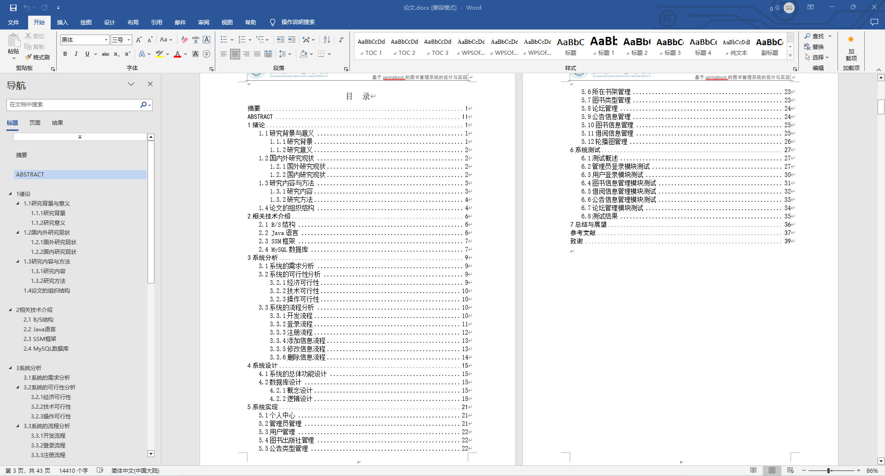
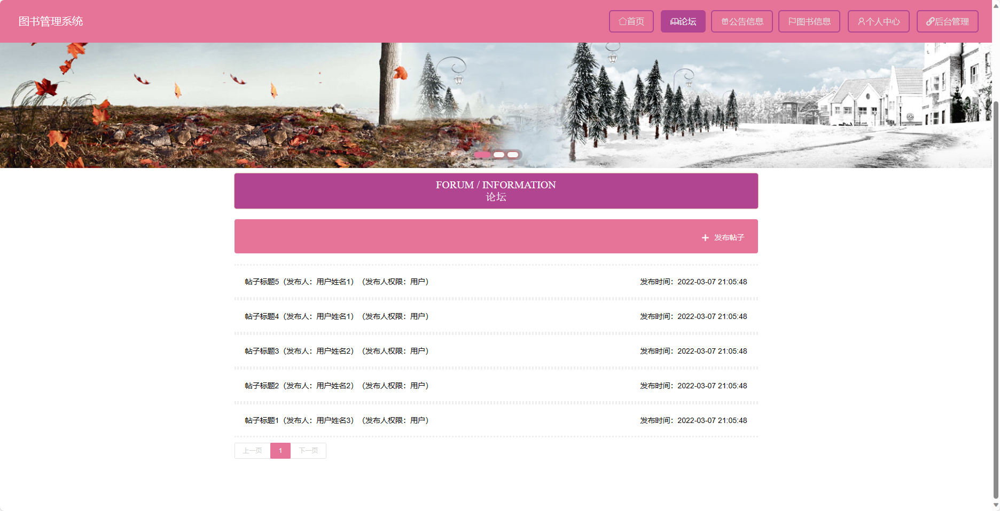
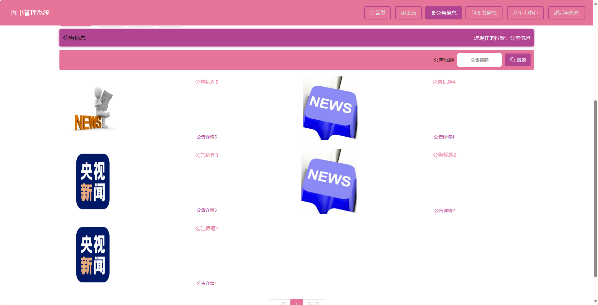
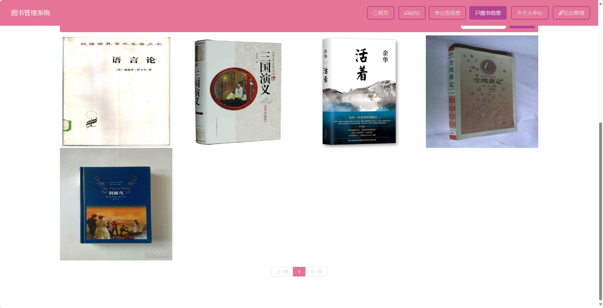
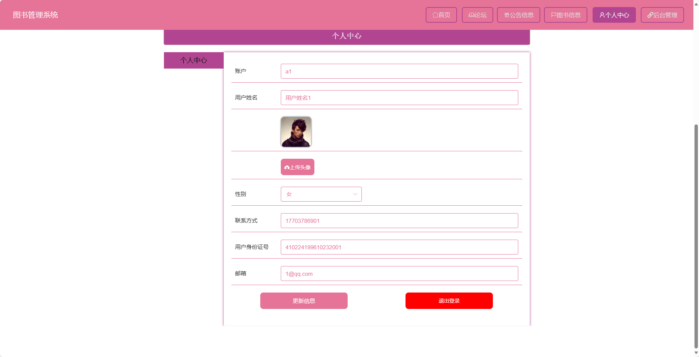
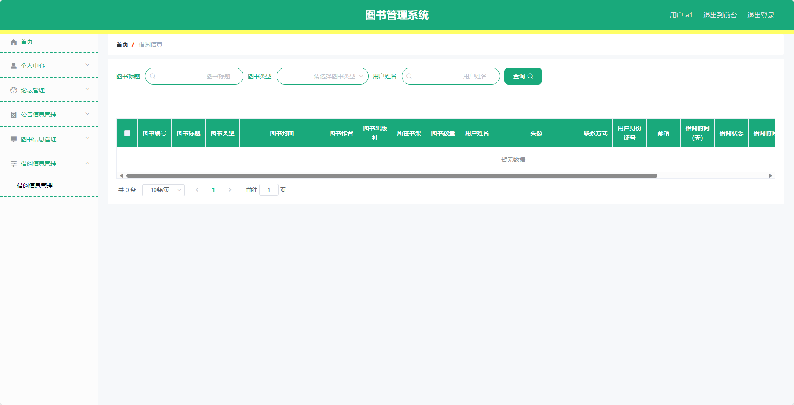

基于SpringBoot的图书管理系统（程序+论文）
=
- 完整代码获取地址：从戎源码网 ([https://armycodes.com/](https://armycodes.com/))
- 作者微信：19941326836  QQ：952045282 
- 承接计算机毕业设计、Java毕业设计、Python毕业设计、深度学习、机器学习
- 选题+开题报告+任务书+程序定制+安装调试+论文+答辩ppt 一条龙服务
- 所有选题地址https://github.com/nature924/allProject

一、项目介绍
---
基于Spring Boot框架实现的图书管理系统，系统包含两种角色：管理员、用户,系统分为前台和后台两大模块，主要功能如下。
### 前台：
- 首页：展示系统推荐、热门图书等信息。
- 论坛：提供用户交流讨论的平台。
- 公告信息：展示系统公告以及最新动态。
- 图书信息：展示系统所有图书的信息。
- 个人中心：提供用户管理个人信息、借阅信息等的入口。

### 后台：

- 用户：
    - 个人中心：管理个人信息。
    - 论坛管理：管理论坛帖子及回复等信息。
    - 公告信息管理：管理系统公告信息。
    - 图书信息管理：管理所有的图书信息。
    - 借阅信息管理：管理用户的借阅信息。
- 管理员：
    - 个人中心：管理个人信息。
    - 管理员管理：管理系统管理员的基本信息。
    - 基础数据管理：管理系统的基础数据信息。
    - 图书出版社管理：管理图书出版社的基本信息。
    - 公告类型管理：管理系统公告的分类信息。
    - 所在书架管理：管理图书所在书架的信息。
    - 图书类型管理：管理系统图书的分类信息。
    - 论坛管理：管理论坛帖子及回复等信息。
    - 公告信息管理：管理系统公告信息。
    - 图书信息管理：管理所有的图书信息。
    - 借阅信息管理：管理用户的借阅信息。
    - 用户管理：管理系统用户的基本信息。
    - 轮播图信息：管理系统首页轮播图的信息。

二、项目技术
---
- 编程语言：Java
- 数据库：MySQL
- 项目管理工具：Maven
- 前端技术：VUE、HTML、Jquery、Bootstrap
- 后端技术：Spring、SpringMVC、MyBatis

三、运行环境
---
- 操作系统：Windows、macOS都可以
- JDK版本：JDK1.8以上都可以
- 开发工具：IDEA、Ecplise、Myecplise都可以
- 数据库: MySQL5.7以上都可以
- Tomcat：任意版本都可以
- Maven：任意版本都可以

四、运行截图
---
### 论文截图：

### 程序截图：

